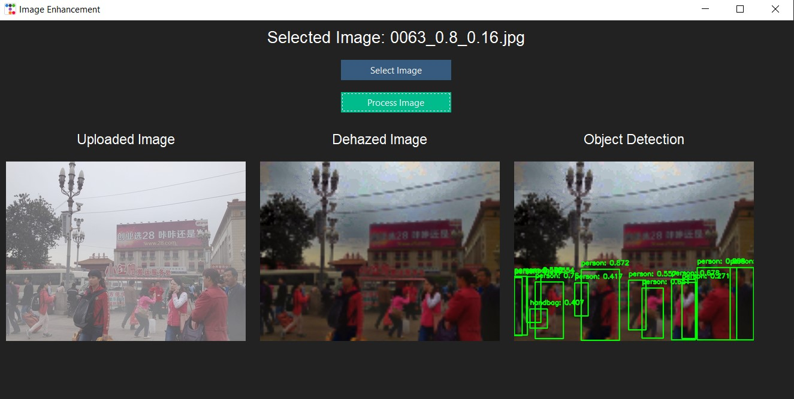
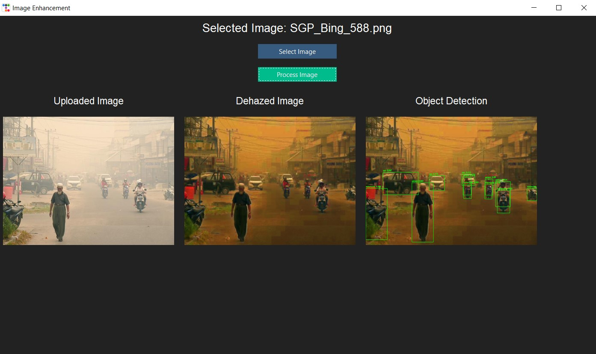

# Dehazed Object Recognition


## Project Description

### Enhancing Object Recognition Accuracy Through Image Dehazing Using Image Pyramid

In many real-world scenarios, images captured under adverse weather conditions such as haze, fog, or smoke suffer from reduced visibility and poor contrast. This degradation significantly hampers the performance of object recognition systems, which rely on clear and detailed images to accurately detect and identify objects. Hazy images introduce ambiguity and noise, leading to lower accuracy and increased false positives and negatives in object detection tasks.

This project aims to develop a comprehensive image enhancement solution to improve the clarity and detail of images captured under hazy conditions. By leveraging the image pyramid technique, Gaussian blurring, and dark channel prior methods, we can effectively reduce haze and enhance image quality. The enhanced images will be integrated with the YOLO (You Only Look Once) object detection framework to significantly improve object recognition accuracy.

Key features of this project include:
- **Development of a robust dehazing algorithm** using the image pyramid technique.
- **Integration with the YOLO framework** for improved object detection.
- **User-friendly GUI** for easy image processing and visualization.
- **Performance validation** to demonstrate the effectiveness of the dehazing algorithm in improving object recognition accuracy.


## Tech Stack

Our project utilizes the following technologies:

| Name                  | Icon                                                                                     |
|-----------------------|------------------------------------------------------------------------------------------|
| TTKBootstrap          |                          |
| OpenCV                |  |
| NumPy                 |     |
| scikit-image          |  |
| SciPy                 |     |
| Ultralytics           |  |
| Pillow                |  |


## Demo Images

### Image 1


### Image 2


## Installation Guide

To set up the project on your local machine, follow these steps:

1. **Clone the Repository:**
    ```bash
    git clone https://github.com/PrakharMishra531/dehazed-object-recognition
    cd yourproject
    ```

2. **Create and Activate Virtual Environment:**
    ```bash
    python -m venv venv
    source venv/bin/activate   # On Windows use `venv\Scripts\activate`
    ```

3. **Install Dependencies:**
    ```bash
    pip install -r requirements.txt
    ```
